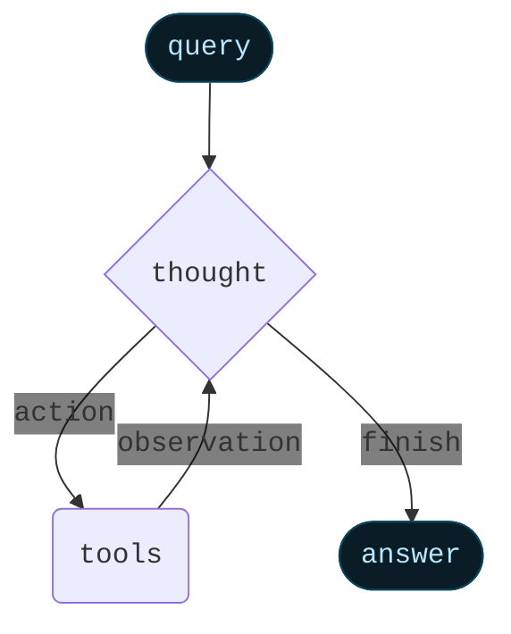
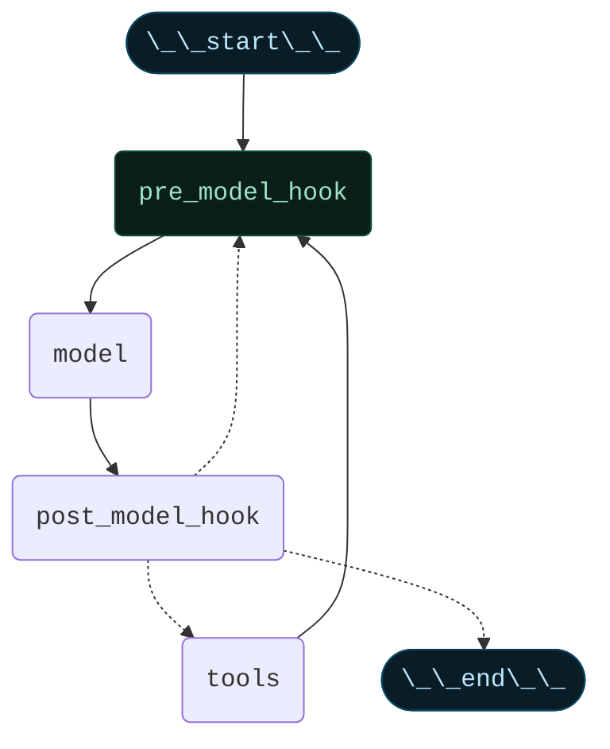
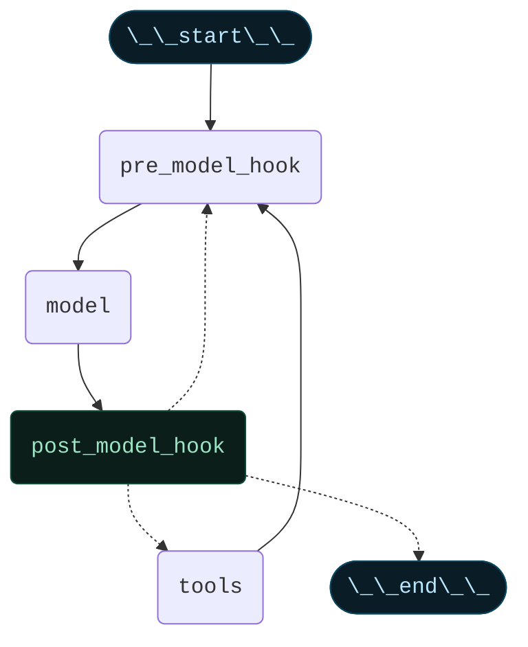

import AlphaCallout from '/snippets/alpha-lc-callout.mdx';

<AlphaCallout />

## Overview

Agents combine language models with tools to create systems that can reason about tasks, decide which tools to use, and iteratively work towards solutions. 

:::python
`create_react_agent()` provides a production-ready ReAct (Reasoning + Acting) agent implementation based on the paper [ReAct: Synergizing Reasoning and Acting in Language Models](https://arxiv.org/abs/2210.03629).
:::
:::js
`createReactAgent()` provides a production-ready ReAct (Reasoning + Acting) agent implementation based on the paper [ReAct: Synergizing Reasoning and Acting in Language Models](https://arxiv.org/abs/2210.03629).
:::

<Columns cols={2}>

<Card>
ReAct frames an agent's behavior as an interleaving of `thought` -> `action` -> `observation` steps, where the model writes out its reasoning, picks a tool, sees the tool's result, and then repeats. ReAct reduces hallucinations and makes the decision process auditable: the agent can form hypotheses (`thought`), test them with tools (`action`), and update its plan based on feedback (`observation`). 

A ReAct loop runs until a stop condition - i.e. when the model emits a final answer or a max-iterations limit is reached.
</Card>

<Card>

</Card>

</Columns>


<Info>
Under the hood, `create_react_agent()` builds a **graph**-based agent runtime using [LangGraph](./langgraph/overview). A graph consists of nodes (steps) and edges (connections) that define how your agent processes information. The agent moves through this graph, executing nodes like the model node (which calls the model), the tools node (which executes tools), or pre/post model hook nodes. Learn more about the [graph API](./langgraph/graph-api).
</Info>

## Core components

### Model

The [model](./langchain-models) is the reasoning engine of your agent. It can be specified in multiple ways, supporting both static and dynamic model selection.

#### Static model

Static models are configured once when creating the agent and remain unchanged throughout execution. This is the most common and straightforward approach. To initialize a static model from a model identifier string:

:::python
```python wrap
from langchain.agents import create_react_agent

agent = create_react_agent(
    "openai:gpt-5", 
    tools=tools
)
```
:::
:::js
```ts wrap
import { createReactAgent } from "langchain";

const agent = createReactAgent({
  model: "openai:gpt-5",
  tools: []
});
```
:::

:::python
Model identifier strings use the format `provider:model` (e.g. `"openai:gpt-5"`) and support automatic inference (e.g. `"gpt-5"` will be inferred as `"openai:gpt-5"`). You may want more control over the model configuration, in which case you can initialize a model instance directly using the [provider package](./integrations/providers):

```python wrap
from langchain.agents import create_react_agent
from langchain_openai import ChatOpenAI

model = ChatOpenAI(
    model="gpt-5", 
    temperature=0.1,
    max_tokens=1000,
    timeout=30
)
agent = create_react_agent(model, tools=tools)
```

Model instances give you complete control over configuration. Use them when you need to set specific parameters like temperature, max tokens, timeouts, or configure API keys, base URLs, and other provider-specific settings. Refer to the [API reference](./integrations/providers) to see available params and methods on your model.
:::
:::js
Model identifier strings use the format `provider:model` (e.g. `"openai:gpt-5"`). You may want more control over the model configuration, in which case you can initialize a model instance directly using the [provider package](./integrations/providers):

```ts wrap
import { createReactAgent } from "langchain";
import { ChatOpenAI } from "@langchain/openai";

const model = new ChatOpenAI({
  model: "gpt-4o",
  temperature: 0.1,
  maxTokens: 1000,
  timeout: 30
});

const agent = createReactAgent({
  model,
  tools: []
});
```

Model instances give you complete control over configuration. Use them when you need to set specific parameters like temperature, max tokens, timeouts, or configure API keys, base URLs, and other provider-specific settings. Refer to the [API reference](./integrations/providers) to see available params and methods on your model.
:::

#### Dynamic model

:::python
<Info>
**`runtime`**: The execution environment of your agent, containing immutable configuration and contextual data that persists throughout the agent's execution (e.g., user IDs, session details, or application-specific configuration).
</Info>

<Info>
**`state`**: The data that flows through your agent's execution, including messages, custom fields, and any information that needs to be tracked and potentially modified during processing (e.g. user preferences or tool usage stats).
</Info>

Dynamic models are selected at runtime based on the current state and context. This enables sophisticated routing logic and cost optimization.

To use a dynamic model, you need to provide a function that receives the graph state and runtime and returns an instance of `BaseChatModel` with the tools bound to it using `.bind_tools(tools)`, where `tools` is a subset of the `tools` parameter.

```python
from langchain_openai import ChatOpenAI
from langchain.agents import create_react_agent, AgentState
from langgraph.runtime import Runtime

def select_model(state: AgentState, runtime: Runtime) -> ChatOpenAI:
    """Choose model based on conversation complexity."""
    messages = state["messages"]
    message_count = len(messages)
    
    if message_count < 10:
        return ChatOpenAI(model="gpt-4.1-mini").bind_tools(tools)
    else:
        return ChatOpenAI(model="gpt-5").bind_tools(tools) # Better model for longer conversations

agent = create_react_agent(select_model, tools=tools)
```
:::
:::js
<Info>
**`state`**: The data that flows through your agent's execution, including messages, custom fields, and any information that needs to be tracked and potentially modified during processing (e.g. user preferences or tool usage stats).
</Info>

Dynamic models are selected at runtime based on the current state and context. This enables sophisticated routing logic and cost optimization.

To use a dynamic model, you need to provide a function that receives the graph state and runtime and returns an instance of `BaseChatModel` with the tools bound to it using `.bindTools(tools)`, where `tools` is a subset of the `tools` parameter.

```ts wrap
import { createReactAgent, AgentState } from "langchain";
import { ChatOpenAI } from "@langchain/openai";

const selectModel = (state: AgentState) => {
  const messageCount = state.messages.length;
  
  if (messageCount > 10) {
    return new ChatOpenAI({ model: "gpt-4.1" }).bindTools(tools);
  }
  return new ChatOpenAI({ model: "gpt-4o" }).bindTools(tools);
};

const agent = createReactAgent({
  llm: selectModel,
  tools,
});
```
:::

<Tip>
For model configuration details, see [Models](./langchain-models).
</Tip>

### Tools

Tools give agents the ability to take actions. Agents go beyond simple model-only tool binding by facilitating:

- Multiple tool calls in sequence triggered by a single prompt
- Parallel tool calls when appropriate
- Dynamic tool selection based on results
- Tool retry logic and error handling
- State persistence across tool calls

Tools can be provided to the agent as either:
:::python
1. A list of tools (LangChain `@tool`, callable, or `dict` that represents a builtin provider tool) 
2. A configured `ToolNode`
:::
:::js
1. A list of tools (created with `tool` function, or object that represents a builtin provider tool) 
2. A configured `ToolNode`
:::

#### Passing a list of tools

Passing a list of tools to the agent will create a `ToolNode` under the hood. This is the simplest way to set up a tool-calling agent:

:::python
```python wrap
from langchain_core.tools import tool
from langchain.agents import create_react_agent

@tool
def search(query: str) -> str:
    """Search for information."""
    return f"Results for: {query}"

@tool
def calculate(expression: str) -> str:
    """Perform calculations."""
    return str(eval(expression))

agent = create_react_agent(model, tools=[search, calculate])
```
:::
:::js
```ts wrap
import { z } from "zod";
import { createReactAgent, tool } from "langchain";

const search = tool(
  async ({ query }) => {
    return `Results for: ${query}`;
  },
  {
    name: "search",
    description: "Search for information",
    schema: z.object({
      query: z.string().describe("The query to search for"),
    }),
  }
);

const calculate = tool(
  async ({ expression }) => {
    return String(eval(expression));
  },
  {
    name: "calculate",
    description: "Perform calculations",
    schema: z.object({
      expression: z.string().describe("The expression to calculate"),
    }),
  }
);

const agent = createReactAgent({
  model: "openai:gpt-4o",
  tools: [search, calculate],
});

const result = await agent.invoke({
  messages: [
    {
      role: "user",
      content:
        "Find wireless headphones, check if they're in stock, and calculate shipping to New York",
    },
  ],
});

console.log(result);
```
:::

If an empty tool list is provided, the agent will consist of a single LLM node without tool calling.

#### Passing a configured ToolNode

Alternatively, you can create a `ToolNode` directly and pass it to the agent. This allows you to customize the tool node's behavior, such as handling tool errors:

:::python
```python wrap
tool_node = ToolNode(
    tools=[search, calculate],
    handle_tool_errors="Please check your input and try again."
)
agent = create_react_agent(model, tools=tool_node)
result = agent.invoke({"messages": [...]})
```

If an error occurs within `ToolNode`, the agent will return a `ToolMessage` to the model with the custom error message:

```python
# result["messages"]
[
    ...
    ToolMessage(content="Please check your input and try again.", tool_call_id="..."),
    ...
]

```
:::
:::js
```ts wrap
import { ToolNode, ToolMessage } from "langchain";

const toolNode = new ToolNode({
  tools: [search, calculate],
  handleToolErrors: (error, toolCall) => {
    return new ToolMessage(
      content="Please check your input and try again.",
      tool_call_id=toolCall.id
    );
  }
});
```
:::

<Tip>
To learn more about error handling in `ToolNode`, see [ToolNode](./langchain-tools#toolnode).
</Tip>

### Tool use in the ReAct loop

Agents follow the ReAct (*Reasoning* + *Acting*) pattern, alternating between brief reasoning steps with targeted tool calls and feeding the resulting observations into subsequent decisions until they can deliver a final answer.

Follow along as an agent applies ReAct to answer a user's question:

<Card title="Prompt: Identify the current most popular wireless headphones and verify availability.">

```
================================ Human Message =================================

Find the most popular wireless headphones right now and check if they're in stock
```

*Reasoning*: "Popularity is time-sensitive, I need to use the provided search tool."

*Acting*: Call `search_products("wireless headphones")`

```
================================== Ai Message ==================================
Tool Calls:
  search_products (call_abc123)
 Call ID: call_abc123
  Args:
    query: wireless headphones
```
```
================================= Tool Message =================================

Found 5 products matching "wireless headphones". Top 5 results: WH-1000XM5, ...
```

*Reasoning*: "I need to confirm availability for the top-ranked item before answering."

*Acting*: Call `check_inventory("WH-1000XM5")`

```
================================== Ai Message ==================================
Tool Calls:
  check_inventory (call_def456)
 Call ID: call_def456
  Args:
    product_id: WH-1000XM5
```
```
================================= Tool Message =================================

Product WH-1000XM5: 10 units in stock
```

*Reasoning*: "I have the most popular model and its stock status. I can now answer the user's question."

*Acting*: Produce final answer

```
================================== Ai Message ==================================

I found wireless headphones (model WH-1000XM5) with 10 units in stock...
```
</Card>

<Tip>
To learn more about tools, see [Tools](./langchain-tools).
</Tip>

### Prompt

You can shape how your agent approaches tasks by providing a prompt. The `prompt` parameter can be provided in several forms.

#### String

:::python
```python wrap
agent = create_react_agent(
    model,
    tools,
    prompt="You are a helpful assistant. Be concise and accurate."
)
```
:::
:::js
```ts wrap
const agent = createReactAgent({
  model,
  tools,
  prompt: "You are a helpful assistant. Be concise and accurate."
});
```
:::

#### SystemMessage

:::python
```python wrap
agent = create_react_agent(
    model,
    tools,
    prompt=SystemMessage(content="You are a research assistant. Cite your sources.")
)
```
:::
:::js
```ts wrap
import { SystemMessage } from "langchain";

const agent = createReactAgent({
  model,
  tools,
  prompt: new SystemMessage("You are a research assistant. Cite your sources.")
});
```
:::

#### Callable

:::python
```python wrap
def dynamic_prompt(state):
    user_type = state.get("user_type", "standard")
    system_msg = SystemMessage(
        content="Provide detailed technical responses." 
        if user_type == "expert" 
        else "Provide simple, clear explanations."
    )
    return [system_msg] + state["messages"]
agent = create_react_agent(model, tools, prompt=dynamic_prompt)
```
:::
:::js
```ts wrap
import { createReactAgent } from "langchain";

const agent = createReactAgent({
  model,
  tools,
  prompt: (state) => {
    const userType = state.userType || "standard";
    return [
      new SystemMessage(
        userType === "expert"
            ? "Provide detailed technical responses."
            : "Provide simple, clear explanations."
      ),
      ...state.messages
    ];
  }
});
```
:::

When no `prompt` is provided, the agent will infer its task from the messages directly.

<Tip>
For more details on message types and formatting, see [Messages](./langchain-messages).
</Tip>

## Advanced configuration

### Structured Output

:::python
In some situations, you may want the agent to return an output in a specific format. LangChain provides a simple, universal way to do this with the `response_format` parameter.

```python wrap
from pydantic import BaseModel
from langchain.agents import create_react_agent

class ContactInfo(BaseModel):
    name: str
    email: str
    phone: str

agent = create_react_agent(
    model,
    tools=[search_tool],
    response_format=ContactInfo
)

result = agent.invoke({
    "messages": [{"role": "user", "content": "Extract contact info from: John Doe, john@example.com, (555) 123-4567"}]
})

result["structured_response"]
# ContactInfo(name='John Doe', email='john@example.com', phone='(555) 123-4567')
```
:::
:::js
In some situations, you may want the agent to return an output in a specific format. LangChain provides a simple, universal way to do this with the `responseFormat` parameter.

```ts wrap
import { z } from "zod";
import { createReactAgent } from "langchain";

const ContactInfo = z.object({
  name: z.string(),
  email: z.string(),
  phone: z.string(),
});

const agent = createReactAgent({
  model: "openai:gpt-4o",
  tools: [],
  responseFormat: ContactInfo,
});

const result = await agent.invoke({
  messages: [
    {
      role: "user",
      content:
        "Extract contact info from: John Doe, john@example.com, (555) 123-4567",
    },
  ],
});

console.log(result.structuredResponse);
/**
 * {
 *   name: 'John Doe',
 *   email: 'john@example.com',
 *   phone: '(555) 123-4567'
 * }
 */
```
:::
<Tip>
To learn about structured output, see [Structured Output](./langchain-structured-output).
</Tip>

### Memory

Agents maintain conversation history automatically through the message state. You can also configure the agent to use a custom state schema to remember additional information during the conversation.

Information stored in the state can be thought of as the "short-term memory" of the agent:

:::python
```python wrap
from typing import TypedDict
from typing_extensions import Annotated
from langgraph.graph.message import add_messages
from langchain.agents import create_react_agent
from langchain.agents import AgentState

class CustomAgentState(AgentState):
    messages: Annotated[list, add_messages]
    user_preferences: dict

agent = create_react_agent(
    model,
    tools=tools,
    state_schema=CustomAgentState
)

# The agent can now track additional state beyond messages. This custom state can be accessed and updated throughout the conversation.
result = agent.invoke({
    "messages": [{"role": "user", "content": "I prefer technical explanations"}],
    "user_preferences": {"style": "technical", "verbosity": "detailed"},
})
```
:::
:::js
```ts wrap
import { z } from "zod";
import { MessagesZodState } from "@langchain/langgraph";
import { createReactAgent, type BaseMessage } from "langchain";

const customAgentState = z.object({
  messages: MessagesZodState.shape.messages,
  userPreferences: z.record(z.string(), z.string()),
});

const CustomAgentState = createReactAgent({
  model: "openai:gpt-4o",
  tools: [],
  stateSchema: customAgentState,
});
```
:::

<Tip>
To learn more about memory, including how to implement long-term memory that persists across sessions, see [Memory](./langchain-memory).
</Tip>

### Pre-model hook

Pre-model hook is an optional node that can process state before the model is called. Use cases include message trimming, summarization, and context injection.



It must be a callable or a runnable that takes in current graph state and returns a state update in the form of:

:::python
```python wrap
{
    # Will UPDATE the `messages` in the state
    "messages": [RemoveMessage(id=REMOVE_ALL_MESSAGES), ...],
    # Any other state keys that need to be propagated
    ...
}
```
:::
:::js
```ts wrap
const agent = createReactAgent({
  model: "openai:gpt-4o",
  preModelHook: (state) => {
    return {
      messages: [RemoveMessage({ id: REMOVE_ALL_MESSAGES }), ...state.messages],
    };
  },
});
```
:::
Example of a pre-model hook that trims messages to fit the context window:

:::python
```python wrap
from langchain_core.messages import RemoveMessage
from langgraph.graph.message import REMOVE_ALL_MESSAGES
from langchain.agents import create_react_agent

def trim_messages(state):
    """Keep only the last few messages to fit context window."""
    messages = state["messages"]
    
    if len(messages) <= 3:
        return {"messages": messages}
    
    first_msg = messages[0]
    recent_messages = messages[-3:] if len(messages) % 2 == 0 else messages[-4:]
    new_messages = [first_msg] + recent_messages
    
    return {
        "messages": [
            RemoveMessage(id=REMOVE_ALL_MESSAGES),
            *new_messages
        ]
    }

agent = create_react_agent(
    model,
    tools=tools,
    pre_model_hook=trim_messages
)
```
:::
:::js
```ts wrap
import { createReactAgent, type AgentState } from "langchain";

const trimMessages = (state: AgentState) => {
  const messages = state.messages;

  if (messages.length <= 3) {
    return { messages };
  }

  const firstMsg = messages[0];
  const recentMessages = messages.length % 2 === 0
    ? messages.slice(-3)
    : messages.slice(-4);

  const newMessages = [firstMsg, ...recentMessages];
  return { messages: newMessages };
};

const agent = createReactAgent({
  model: "openai:gpt-4o",
  tools,
  preModelHook: trimMessages,
});
```
:::

<Info>
`messages` must be provided and will be used as an input to the `agent` node (i.e., the node that calls the LLM). The rest of the keys will be added to the graph state.
</Info>

<Warning>
If you are returning `messages` in the pre-model hook, you should OVERWRITE the `messages` key by doing the following:

:::python
```python wrap
{
    "messages": [RemoveMessage(id=REMOVE_ALL_MESSAGES), *new_messages]
    ...
}
```
:::
:::js
```ts wrap
import { RemoveMessage } from "@langchain/core/messages";
import { REMOVE_ALL_MESSAGES } from "@langchain/langgraph";

const agent = createReactAgent({
  // ...
  preModelHook: (state) => {
    // ...
    return {
      messages: [
        RemoveMessage({ id: REMOVE_ALL_MESSAGES }),
        ...state.messages
      ],
    };
  };
});
```
:::
</Warning>

### Post-model hook

Post-model hook is an optional node that can process the model's response before tool execution. Use cases include validation, guardrails, or other post-processing.



It must be a callable or a runnable that takes in current graph state and returns a state update.

Example of a post-model hook that filters out confidential information:

:::python
```python wrap
from langchain_core.messages import AIMessage, RemoveMessage
from langgraph.graph.message import REMOVE_ALL_MESSAGES

def validate_response(state):
    """Check model response for policy violations."""
    messages = state["messages"]
    last_message = messages[-1]
    
    if "confidential" in last_message.content.lower():
        return {
            "messages": [
                RemoveMessage(id=REMOVE_ALL_MESSAGES),
                *messages[:-1],
                AIMessage(content="I cannot share confidential information.")
            ]
        }
    
    return {}

agent = create_react_agent(
    model,
    tools=tools,
    post_model_hook=validate_response
)
```
:::
:::js
```ts wrap
import { createReactAgent, type AgentState, AIMessage, RemoveMessage } from "langchain";
import { REMOVE_ALL_MESSAGES } from "@langchain/langgraph";

const validateResponse = (state: AgentState) => {
  const lastMessage = state.messages.at(-1)?.content as string;
  if (lastMessage.toLowerCase().includes("confidential")) {
    return {
      messages: [
        new RemoveMessage({ id: REMOVE_ALL_MESSAGES }),
        ...state.messages.slice(0, -1),
        new AIMessage("I cannot share confidential information."),
      ],
    };
  }
  return {};
};

const agent = createReactAgent({
  model: "openai:gpt-4o",
  tools,
  postModelHook: validateResponse,
});
```
:::

### Streaming

We've seen how the agent can be called with `.invoke` to get a final response. If the agent executes multiple steps, this may take a while. To show intermediate progress, we can stream back messages as they occur.

:::python
```python wrap
for chunk in agent.stream({
    "messages": [{"role": "user", "content": "Search for AI news and summarize the findings"}]
}, stream_mode="values"):
    # Each chunk contains the full state at that point
    latest_message = chunk["messages"][-1]
    if latest_message.content:
        print(f"Agent: {latest_message.content}")
    elif latest_message.tool_calls:
        print(f"Calling tools: {[tc['name'] for tc in latest_message.tool_calls]}")
```
:::
:::js
```ts wrap
const stream = await agent.stream(
  {
    messages: [new HumanMessage("What's the weather in NYC?")],
  },
  { streamMode: "values" }
);

for await (const chunk of stream) {
  // Each chunk contains the full state at that point
  const latestMessage = chunk.messages.at(-1);
  if (latestMessage?.content) {
    console.log(`Agent: ${latestMessage.content}`);
  } else if (latestMessage?.tool_calls) {
    console.log(`Calling tools: ${latestMessage.tool_calls.map((tc: ToolCall) => tc.name).join(", ")}`);
  }
}
```
:::

<Tip>
For more details on streaming, see [Streaming](./langchain-streaming).
</Tip>
